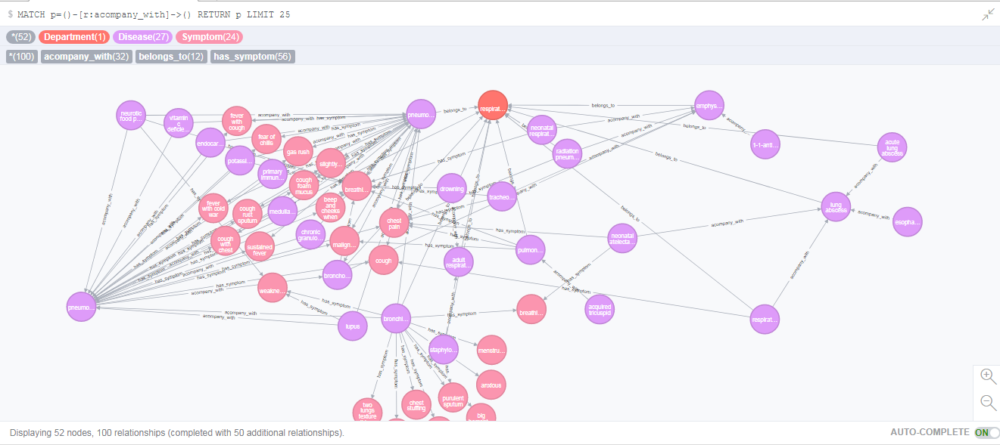
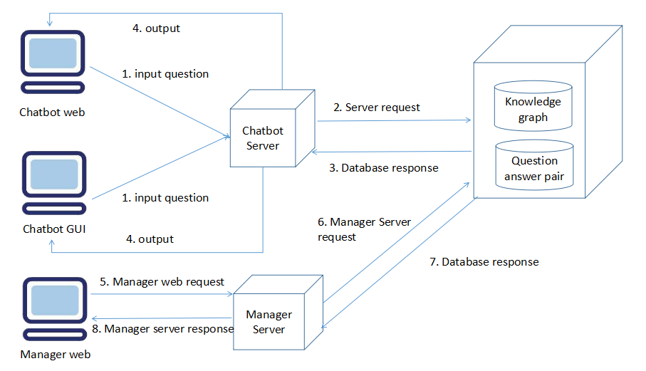
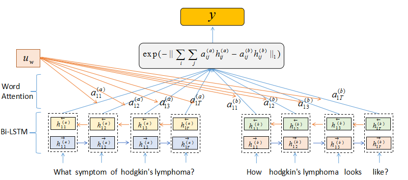
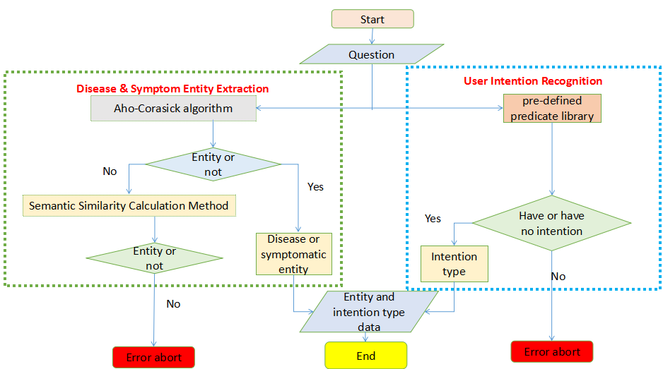
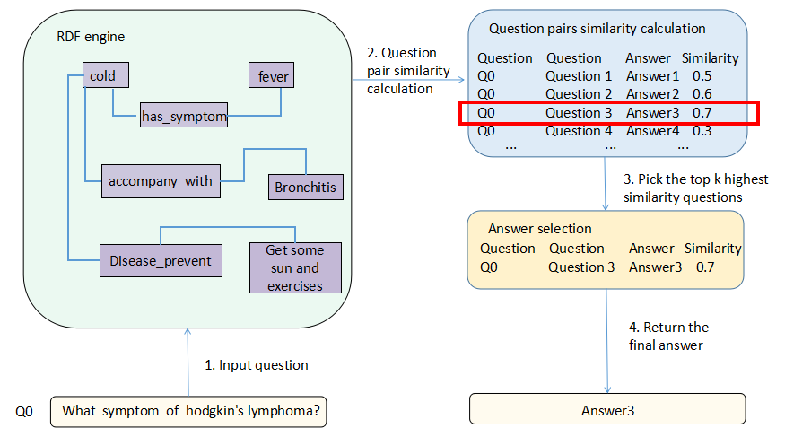

# HBDA-An-Online-Question-Answering-System-for-Medical-Questions
## System description
The system can be divided into two parts. The first part is the knowledge graph question answering and the second part is if the 
knowledge graph cannot find the answer of the user inputted question, the second part will help to retrieve the top k most related answers by computing the medical question similarity from a medical question answer pair dataset.

Here are some useful reference links.
## Knowledge graph establishment refer the following link
https://github.com/liuhuanyong/QASystemOnMedicalKG

## Google English words pre-train model: GoogleNews-vectors-negative300.bin.gz
The pre-train model will be used to load word embedding before training the BiLSTM+Attention model and HBDA model.

https://drive.google.com/file/d/0B7XkCwpI5KDYNlNUTTlSS21pQmM/edit?usp=sharing

## BERT
https://github.com/google-research/bert

## BiLSTM+Attention
https://zhuanlan.zhihu.com/p/31638132

https://github.com/likejazz/Siamese-LSTM

https://github.com/LuJunru/Sentences_Pair_Similarity_Calculation_Siamese_LSTM

## AttentionLayer is referred from the following link
https://github.com/uhauha2929/examples/blob/master/Hierarchical%20Attention%20Networks%20.ipynb

## Dataset
### Medical knowledge dataset collected from the following medical website
https://www.medicinenet.com/medterms-medical-dictionary/article.htm

https://www.nhsinform.scot/illnesses-and-conditions/a-to-z

### Model train_dev_test dataset are filter out the medical related questions from Quora question pair dataset.
https://data.quora.com/First-Quora-Dataset-Release-Question-Pairs

### Medical question and answer pair dataset is referred from the following link.
https://github.com/LasseRegin/medical-question-answer-data

### Model eval-accuracy comparison 
The total number of medical related data from Quora dataset is nearly 70000, but we randomly pick the 10000 as the (train/dev/test) dataset.

The number distribution of train: dev: test = 6:2:2

|Model|Average Eval_accuracy by three times|Range of change|
|:---|:---|:---|
|BERT baseline model|0.7686|(-0.0073, +0.0057)|
|HDBA model|**0.8146**|(-0.0082, +0.0098)|
|Bi-LSTM + Attention model|0.8043|(-0.0103, +0.0062)|

### The scale of knowledge graph about 700 diseases. For each disease, there exists symptom, accompany_disease, prevent_way, cure_way and totally 6 entities.


### System architecture


### Web GUI manager


### Siamese Hierarchical BiLSTM Word Attention Manhattan Distance model


### Reference papers
Hierarchical attention networks for document classification (https://www.aclweb.org/anthology/N16-1174)

Siamese Recurrent Architectures for Learning Sentence Similarity (https://www.aaai.org/ocs/index.php/AAAI/AAAI16/paper/viewPaper/12195)

### Disease symptom entity extraction & User intention recognition


### Knowledge graph answer selection


### Question_answer_pair_answer_selection


## Paper link
[HHH: An Online Medical Chatbot System based on Knowledge Graph and Hierarchical Bi-Directional Attention](https://arxiv.org/pdf/2002.03140.pdf)

## Citation
```
@inproceedings{bao2020hhh,
  title={HHH: An Online Medical Chatbot System based on Knowledge Graph and Hierarchical Bi-Directional Attention},
  author={Bao, Qiming and Ni, Lin and Liu, Jiamou},
  booktitle={Proceedings of the Australasian Computer Science Week Multiconference},
  pages={1--10},
  year={2020}
}
```

## Acknowledgement
This research was supported by summer scholarship funding from the Precision Driven Health research partnership.

## Other links
[MANDY: Towards a Smart Primary Care Chatbot Application](https://link.springer.com/chapter/10.1007/978-981-10-6989-5_4)
